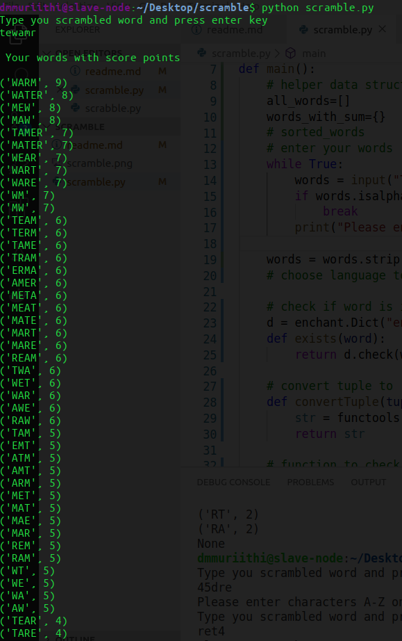

##### Cheat playing scramble game

Not exactly cheating but automating the process of getting a combination of possible words. :)

###### How it works
provide words that you are supporsed to scramble, the small tool based on recursion algorithim will perform permutations to your words and check if those words exists in the dictionary and display the list of all words.

###### Customization
- language options - (en_GB, en_US, de_DE, fr_FR).
- minimum length of characters in the final word - default is 2 but you can increase as you wish

###### Tools
- python3.8 
- enchant library to check if a word exists in the dictionary.

###### Installation
- install python3(if not installed).
- install enchant library ```pip install PyEnchant```

###### Running
- open terminal/cmd in the same directory/folder with ```scramble.py``` file.
- execute   ```python scramble.py```
- a prompt to enter your word is given.
- provide your word and a list of all your words are displayed.

###### Example



##### Improvements
- create a web gui.

#### Licence
[MIT](https://mit-license.org/) (c) 2020 [muriithi derrick](https://github.com/derrick-gopher)
